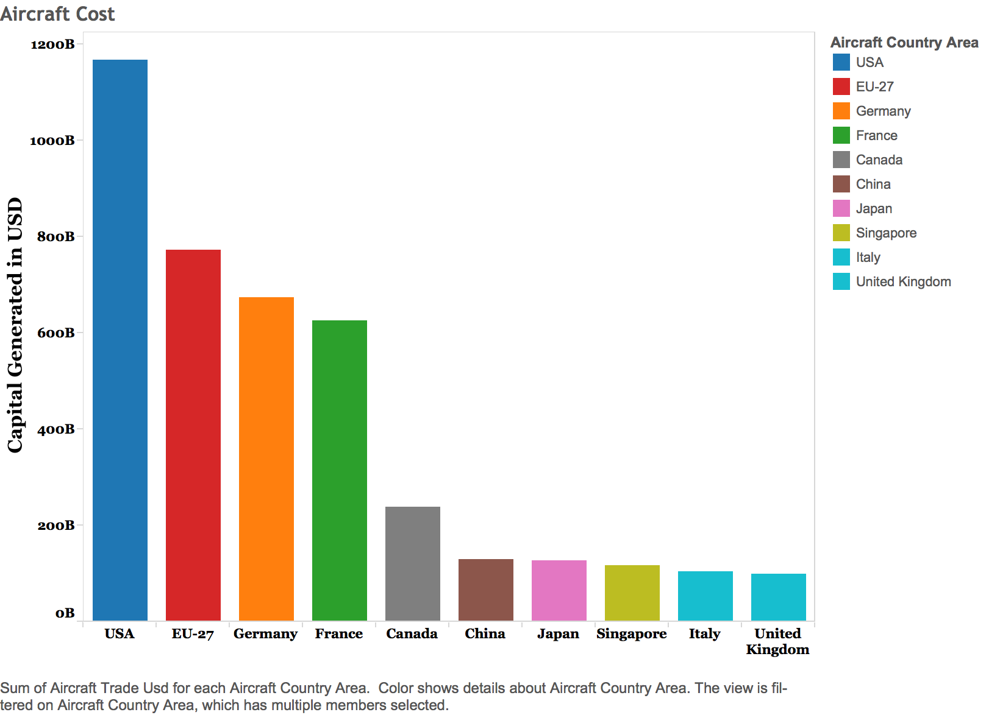
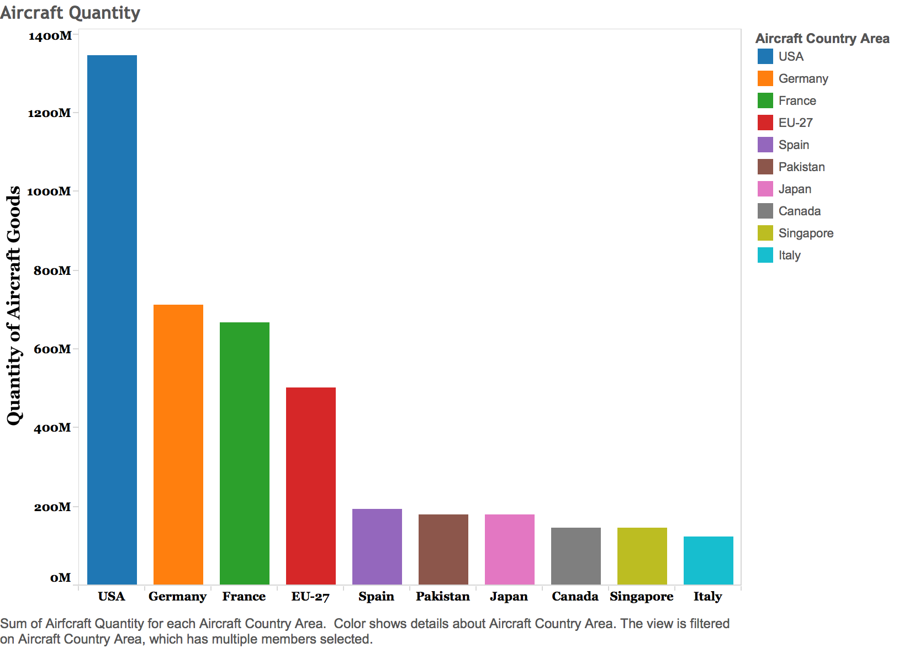
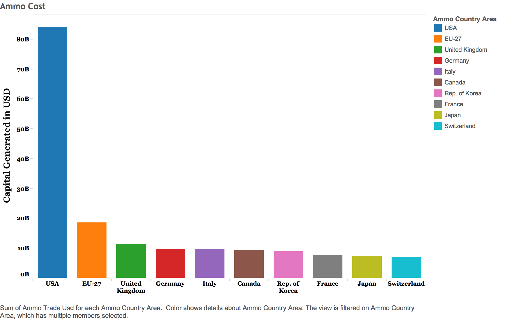
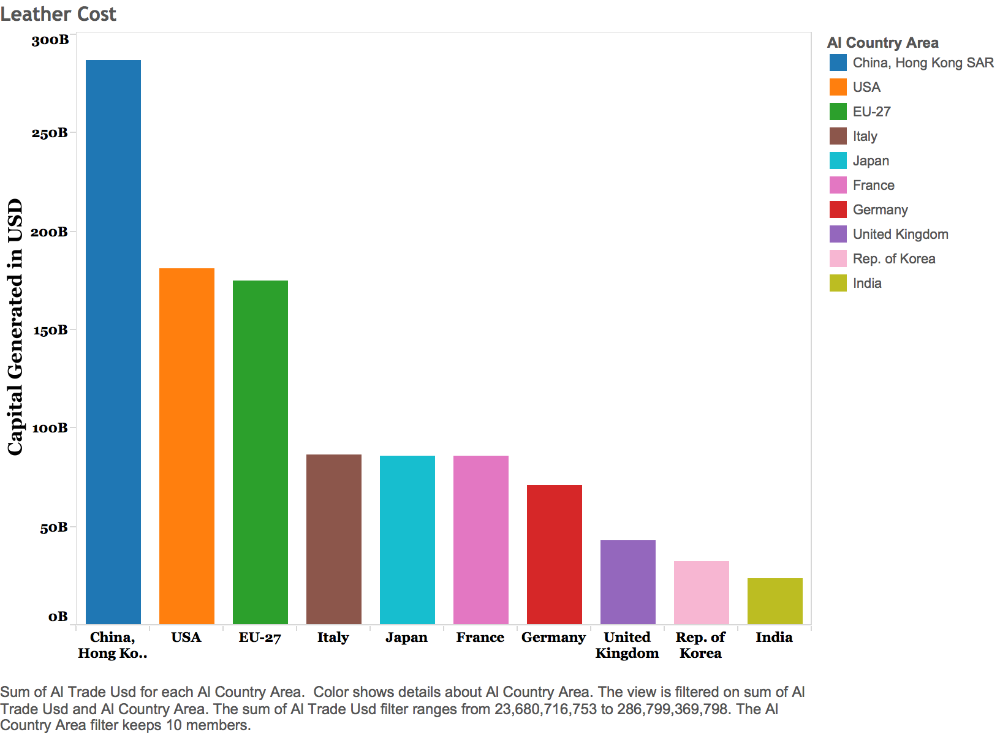
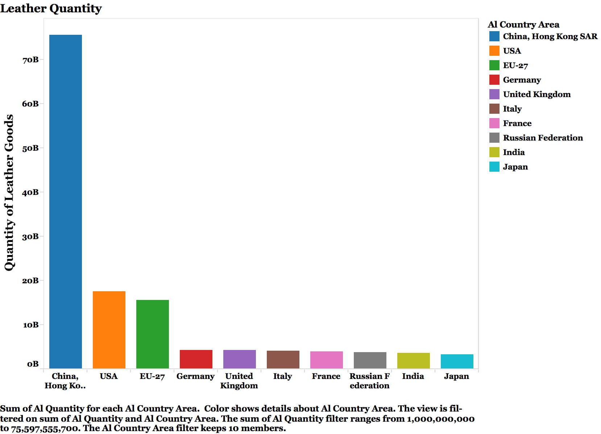

Our group has been working with United Nations commodity trade statistics since the class transitioned from RStudio to Tableau. There are 98 sets of trade data on Enigma, so we chose to narrow our scope of inquiry to three categories: aircraft and spacecraft trade, arms and ammunition trade, and the trade of leather goods. One of the benefits of using this data is that the data sets have a uniform format, which helps with data blending and comparing the data sets. 

According to Enigma, where we obtained this data, over 140 countries contribute their international trade data to the United Nations Statistics Division. The division has more than 1 billion trade records spanning over 60 years of time from 1962 to the present.

###Each data set has the following columns:###

**Country_Area** - The name of the country engaged in trade

**Year** - The year in which the trade took place

**Comm_Code** - The specific code for the commodity being traded

**Commodity** - A description of the commodity being traded

**Flow** - Indicator of whether the goods were imported or exported from the country

**Trade_USD** - The amount of money that changed hands during the trade

**Weight** - The weight of the goods that were traded in kilograms

**Quantity** - The approximate number of items traded

**Quantity_Name** - Indicator of whether the number in the quantity column is the number of items or the weight of the traded commodities

**SerialID** - The unique serial number given to each trade, starting at 101 and increasing by one per trade until the final recorded trade in the data.

Because there are so many records in the data we are examining, we have decided to narrow our focus even more and analyze how the United States fits into the global trade of the three previously mentioned commodities. Below we have created some visualizations to show where the US stands on the global commodities trade landscape.

###Here is a summary of the data that we are using.
```{r}
source("../01 Data/FinalProjectData.R", echo = TRUE)
```

#R

##Data Wrangling

###Using data wrangling to show the ratio of a country's total trades in a particular commodity to that of the USA.
The wranglings we decided to do consist of first counting the number of individual trades, not individual trade iteams, for each country in the three commodities we selected to focus on (Aircraft, ammo and article leather respectively). Then we divided that total for each country for a particular commodity, by the total that the USA had for that commodity in order to give a ratio. As we found, the USA did not have the top spot in any of the three commodities we chose to look at. And that there was often very little room between the USA and curtain other countries. Both imports and exports were counted in these numbers.
```{r}
source("../02 Data Wrangling/FinalProjectWranglings.R", echo = TRUE)
```

##Visualizing these trade ratios.

We made visualizations for our data wrangling sets to better illustrate our findings. The visualizations are basically bar charts. The first visualization shows countries that have a ratio of their total number of aircraft trades to the total number of USA aircraft trades greater than .71. The second visualization shows countries that have a ratio of their total number of ammo trades to the total number of USA aircraft trades greater than .705. The third visualization shows countries that have a ratio of their total number of leather trades to the total number of USA leather trades greater than .9. These ratios were chosen in order to clean up the visualizations. 

```{r}
source("../03 Visualizations/FinalProjectVisualizations.R", echo = TRUE)
```

##Trade Rankings Based on USD

What is below are the head() of the data frames containing the rankings of the countries determined by united state's dollar amount (USD), from both imports and exports, for aircraft, ammo and leather trades.

```{r}
source("../01 Data/CTFPD.R", echo = TRUE)
```

#Tableau

To reproduce the plots below for each commodity (Aircraft, Ammo and Leather respectively) 
**1.Put Country Area in columns, Trade USD/Quantity in rows**
**2. Filter the top 10 by Trade USD/Quantity** 
**3. And then sort the top 10 in descending order**
**4. Then color them based on Country Area**


The divide between the United States and the next highest capital generating entity is smaller than the total quantity gap. The United States has generated $395 billion more than the trade which is attributed to the EU-27 members, which takes the second spot on the chart.


The United States leads the world in total quantity of aircraft and spacecraft goods, having approximately 1.35 billion items traded. The amount of trade conducted by fifth through tenth place only adds up to 71.5% of the trade done by the United States.



The gap in capital generated by trading ammunition goods is less staggering. Despite the huge disparity in volume of trades, the United States only accounts for 34% of the capital generated according to these UN trade statistics.


Unsurprisingly, the United States blows every other nation out of the water when it comes to the trade of ammunition and firearms. The total recorded ammunition goods trades sits at over 217 billion items. The United States has the lion’s share of that trade with almost 204 billion items, leaving about 13 billion item trades that can be attributed to other nations.


However, the relative gap in total capital generated through imports and exports is much smaller. The United States has generated $105 billion less than China through leather imports and exports since the inception of UN commodity trade stats.


The United States doesn’t even come close to being the top leather goods trading nation in terms of total quantity. China (with Hong Kong included in their numbers) takes the top spot with over 75 billion items being recorded in the UN trade statistics.


In this visualization, we looked at which leather goods yielded the highest total weight per trade. As you can see, China and the USA were close in total weight. Yet, in general, China had the most overall for the various types of commodities in the trade market between the countries analyzed. 


Despite the USA joining the Aircraft Trade Market, later than its competitors, it was fairly higher for export and trade than Aircraft Trade “veterans”.  Also, USA stayed consistent for import and export while other countries were consistent for import but inconsistent for export trade.
